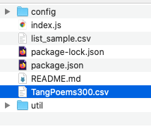
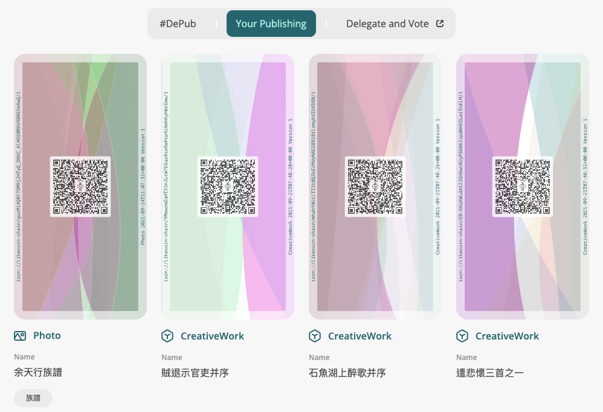

# Register ISCN in batch

## Register multiple ISCN records

### Before you start <a id="a5db"></a>

1. Choose a tool for editing CSV files. Free Google spreadsheet is recommended. Prepare the data to be registered in CSV format.
2. A Mac or Linux computer as we are going to demonstrate on a Mac console. The computer should have node.js and git installed, the latter is optional. The operation in Windows should be more or less the same.
3. A wallet with a small amount of LikeCoin. Keplr is recommended as you will need the seed words of the wallet for one of the steps. ISCN registration costs LikeCoin and that’s really a steal at the moment. Try it out before the price rises.

### Step 1: Prepare your data <a id="bafb"></a>

This step does not require technical background, but it is time-consuming. Below is an example of the [300 Tang Poems](https://github.com/edmondyu/TangPoems300/blob/main/TangPoems300.csv) data file.


The[ ISCN spec](https://iscn.io/) recommends fields defined according to [CreativeWork](https://schema.org/CreativeWork) type in schema.org. Most raw data’s fields do not comply with this standard in the first place. We are going to change the column headers in the CSV file to comply with the standard.

Here is my tuned version \(original fields &gt; CreativeWork fields\):

* ID &gt; identifier
* author &gt; author
* title &gt; name
* genre &gt; genre
* poem text &gt; text
* web link &gt; url
* license &gt; usageinfo

Note that the following two columns are not defined in CreativeWork fields, but needed by the [iscn-batch-uploader](https://github.com/likecoin/iscn-batch-uploader) tool. We will look into the tool later.

The two fields:

* ipfsHash: iscn-batch-uploader tool treats this field as the “[Content Fingerprints](https://iscn.io/schema/contentFingerprints)” of ISCN record.
* type: it’s the type defined in schema.org, e.g.: Creative Work, Book, Game, Painting, Article, Photograph, Episode, etc. iscn-batch-uploader treats all records as “CreativeWork” type by default if this field is not specified in the CSV file.

Blockchain transaction are expensive so it is not cost-effective to store large data files, but storing smaller content such as poem text seems reasonable. For demonstration purposes, however, the poem text will be put to a separate txt file as well and uploaded  them to [Pinata IPFS service](https://www.pinata.cloud/) so that  an IPFS hash for ISCN content fingerprint will be acquired for each record. iscn-batch-uploader does not support [Arweave](https://www.arweave.org/) link as content fingerprint at the moment, expect to have this feature in the near future.

You will need a batch uploading tool for IPFS batch uploading and pinning. but this feature is not catered by iscn-batch-uploader. You may have to use the Pinata GUI to upload the files one-by-one and then copy the hash to the CSV file if you are not a programmer. The IPFS upload process is tedious and not suitable for processing large amounts of data.  You are suggested to complete the IPFS task later with a better tool, as you can upload all the metadata in the CSV file for ISCN. You can always update the registered ISCN records, say, filling up the IPFS hashes as content fingerprints, to new versions later.

If you know coding, however, you may try my [python tool for Pinata](https://github.com/edmondyu/pinata-python-util). Welcome for pull requests.

Our example of Tang Poems contains 300 records only. You may prepare a much larger amount of data in the same way, however. Feel free to commit all verses of “The Bible”, Shakespeare’s scripts, all of your blogs, music scores, newspaper archives, or minutes of public authorities to the LikeCoin chain. There is a lot of work to do for those without any technical background.

### Step 2: Install iscn-batch-uploader <a id="c676"></a>

```text
git clone https://github.com/likecoin/iscn-batch-uploader.git
```

If you have git installed in your computer, you just need to run the above command in your terminal, under your selected working directory, to download [iscn-batch-uploader](https://github.com/likecoin/iscn-batch-uploader). If you do not have git ready, you can download the program zip file from GitHub directly \(click the green “Code” button on the top right corner\), uncompress the file to get the program directory.


cd to the program directory in your terminal, type the following command to install the program:

```text
npm install
```

### Step 3: Edit the config file

There is a “config.js” file under the “config” directory of the program directory. Edit it with any text editor tool, modify the line config.COSMOS\_MNEMONIC and fill in the seed phrase of your LikeCoin wallet, for example:

```text
config.COSMOS_MNEMONIC = ‘paint man cloud google winnie pool think hell imposition police illegal tyranny’;
```

### Step 4: Copy CSV data file to the working directory <a id="f95a"></a>

Copy the CSV data file that you want to register ISCN, in our demo “TangPoem300.csv”, to the iscn-batch-uploader directory.




### Step 5: Execute the uploader command <a id="3737"></a>

The installation is ready. After confirming iscn-batch-uploader as the current directory and execute the following command:

```text
node index.js [your csv filename]
```

\[your csv filename\] is your data file name, hence in our example it is:

```text
node index.js TangPoems300.csv
```


Registering 300+ ISCN records costs less than 1 LIKE?! It’s a really good deal. Try it out now.

### Step 6: Verify on blockchain <a id="c2b3"></a>

A new file “output.csv” will be generated after you execute the command successfully. Two more columns are added to the new CSV when comparing with the original data file: _txHash_ and _iscnId_.

txHash is the transaction hash on the LikeCoin chain. You can search the tx hash by supported block explorer such as Big Dipper, e.g. try this tx hash:

```text
C75B2BD9C79A83670C49F97522E7670CBB7E4892CAC26D5F09E5913C57870E5C
```

Toggle the “Raw” option to view the details of the registered ISCN information.

The iscnId is the unique content ID supported by the LikeCoin chain. You can check the ID up in [app.like.co](https://app.like.co/). For example, try searching for

```text
iscn://likecoin-chain/9MewrmZqHT55nJLtW7EGqo8szOwKtp42AmhKyhWrImw/1
```

in app.like.co to view the poem registry.


You can check all the registered ISCN records in app.like.co. Login \(by Keplr\) with the wallet that you have filled the seed words into the config file of iscn-batch-uploader, click “Your Publishing” and check your registration. Only the first 100 records can be displayed in app.like.co however.



## Advance: Updating ISCN versions

iscn-batch-uploader supports updating metadata versions:

* Prepare the data that needs to be updated in the CSV file. Entire set of field values are needed, the ISCN record will be overwritten by the rows in the data file except the iscnId.
* Run the command index.js again, with the parameter “_update_”, syntax:

```text
node index.js TangPoems300A.csv --update
```

When the script reads records with iscnId ready, it will update the record with the new version of metadata, but not register a new ISCN. The last digit after the backslash reflects the version number, e.g. /1 represents version 1, and /2 represents version 2. [app.like.co](https://app.like.co/) gets the most updated version of ISCN records by default if no version number is given.

## Issue: what to do if registration fails?

iscn-batch-uploader fails to register particular ISCN records occasionally for unknown reason. The program retries 1 time upon failure, and will skip to next record if retry fail. You need to inspect the details of _output.csv_ for any records that misses iscnId and txHash.

The best way to amend the missed records is to re-run _index.js_ with the renamed _output.csv_ as the input file parameter. e.g.:

```text
node index.js fromOutputFile.csv
```

The script will skip those records that already have iscnId, the “_update_” parameter is not given upon execution.

